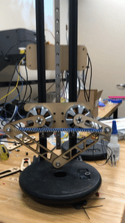
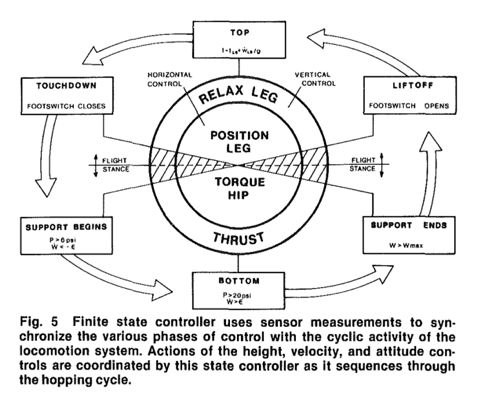

# Jumping in place

This assignment will explore the dynamics of jumping in place with specific emphasis on exploiting elastic mechanisms to increase jump height. The HW will culminate in a jump competition where each group will demo their jumping ability in class next Monday. __The HW deliverable will be the code used to implement your jump, and a video uploaded to youtube__. 

## Project constraints

* You will be allowed to use elastic elements (springs and rubber bands) in your robot.
* We will measure peak jump height over a 10s period. 
* Repeated jumps are encouraged.
* Jump control can be closed-loop or open-loop.

## Hints for a successful jump

From the Raibert hopper discussion we know a bouncing gait can be partitioned into four regimes.

In order to maximize your robot height over successive jumps you will want to be able to detect these regimes and change the control commands to the motors dependent on which state you are in. In your jump code you should have steps to: 

1. Detect ground collision and descending motion of the robot.
2. Detect peak descent and transition to the upwards stance phase.
3. Detect liftoff. 

